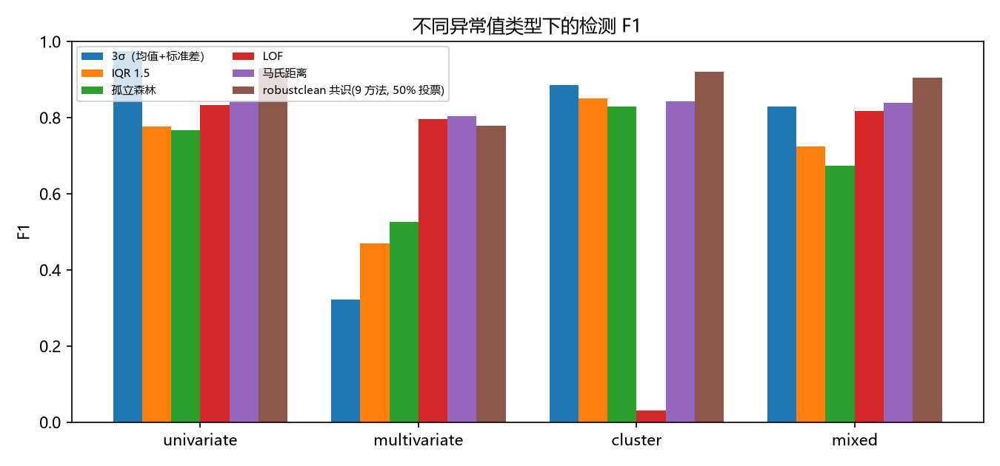
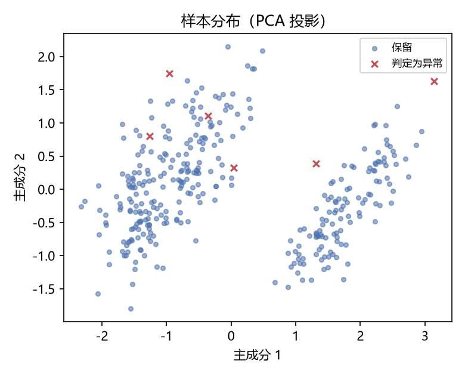

# robustclean

**给科研数据的异常值检测与清洗工具：九个方法投票，每一步都留下可辩护的证据。**

数据处理里最难回答的问题不是「怎么删异常值」，而是审稿人那一句：
**「你凭什么用这个阈值？」** robustclean 的思路是：不靠单一方法，
让九个原理互不相同的检测器各自投票，并把每一个判定过程写进报告——
包括参数的出处、被剔除的样本编号、以及剔除前后的统计量变化。

## 它解决什么问题

| 常见做法 | 问题 |
| --- | --- |
| 均值 ± 3σ | 均值和标准差本身就被异常值污染，越极端越检测不出来 |
| 手拍一个阈值 | 论文里写不出口径，换一批数据就失效 |
| 只用一个算法 | 单变量异常值漏检、多变量组合异常值完全看不见 |
| 直接删掉 | 没人知道删了多少、删了谁，结论可复现性差 |

## 安装

```bash
pip install -r requirements.txt
# 或者安装成本地包，之后可以直接用 robustclean 命令
pip install -e .
```

## 三十秒上手

```python
import pandas as pd
from robustclean import RobustCleaner

df = pd.read_csv("你的实验数据.csv")

cleaner = RobustCleaner(vote_ratio=0.5).fit(df)
print(cleaner.summary())          # 每个检测器标记了多少个

cleaned = cleaner.clean(df, strategy="remove")
cleaner.save("output/", df)       # 报告、图表、审计日志一次全部导出
```

命令行（不想写代码就用这个）：

```bash
python -m robustclean 数据.csv -o output --vote-ratio 0.5 --strategy remove
python -m robustclean 数据.csv -o output --group 处理组   # 每个组内分别检测
python -m robustclean 数据.csv --dry-run                  # 只看结果不写文件
```

## 九个检测器

全部只用稳健统计量，且都能对应到《统计学习方法》（李航，第 2 版）里的经典方法：

| key | 方法 | 教材对应 | 擅长的异常值 |
| --- | --- | --- | --- |
| `mad` | MAD 稳健 Z 分数（阈值 3.5） | 稳健统计 | 单变量极端值 |
| `iqr` | Tukey 箱线图准则（k=1.5） | 稳健统计 | 单变量偏离 |
| `hampel` | Hampel 滤波（滑动窗口） | 时序平滑 | 有序数据中的突变点 |
| `mahalanobis` | 马氏距离（MCD 稳健协方差，χ² 0.975） | 多元正态 | 多变量组合异常 |
| `pca` | PCA/SVD 重构误差 | 第 15、16 章 奇异值分解 / 主成分分析 | 偏离主成分结构 |
| `knn` | k 近邻距离 | 第 3 章 k 近邻法 | 局部密度低的点 |
| `lof` | 局部离群因子 | 第 3 章（密度视角） | 密度不均的数据 |
| `iforest` | 孤立森林（300 棵树） | 第 8 章 提升方法（集成思想） | 高维、无分布假设 |
| `dbscan` | DBSCAN 噪声点 | 第 14 章 聚类方法 | 成簇混入的外来批次 |
| `gmm` | 高斯混合模型（EM，BIC 选元） | 第 9 章 EM 算法 | 多峰分布的数据 |

> `hampel` 只适用于**有顺序**的数据（时间序列、按测量顺序排列的样本），
> 对无序数据启用它会引入人为的顺序依赖，所以默认关闭。

## 效果（可复现，自己跑）

```bash
python benchmarks/benchmark_vs_baselines.py
```

在四类异常值、每类 800 个样本 × 5 个变量的合成数据上（注入比例 5%，已知真值），
各方法的 F1：

| 方法 | 单变量极端值 | 多变量组合 | 外来簇 | 混合 | **平均 F1** | 平均假阳性率 |
| --- | --- | --- | --- | --- | --- | --- |
| **robustclean 共识** | 0.930 | **0.779** | **0.920** | **0.905** | **0.883** | **0.86%** |
| 马氏距离 | 0.842 | 0.804 | 0.842 | 0.839 | 0.832 | 1.94% |
| 均值 ± 3σ | **0.976** | 0.321 | 0.886 | 0.829 | 0.753 | 0.46% |
| IQR 1.5 | 0.777 | 0.469 | 0.851 | 0.723 | 0.705 | 2.60% |
| 孤立森林 | 0.768 | 0.525 | 0.830 | 0.674 | 0.699 | 2.43% |
| LOF | 0.833 | 0.796 | 0.030 | 0.817 | 0.619 | 2.40% |

几点诚实说明：

- 在**单变量极端值**这种简单场景里，朴素 3σ 反而略好（0.976 对 0.930）——
  因为数据已经「异常得很明显」时，简单方法足够用。
- 共识方法的价值在**多变量组合异常**：3σ 只有 0.321，共识 0.779。
  这类异常值每个变量上只偏 1.5–2.5 个标准差，单变量方法原理上就看不见。
- LOF 在「外来簇」场景几乎失效（0.030）——它的局部密度假设被成簇的异常值破坏了。
  这正说明为什么要投票：任何单一方法都有系统性盲区。
- 共识方法的假阳性率也是最低的一档（0.86%），不是靠「多杀」换召回。



## 真实数据演示

拿 344 只企鹅的形态数据（palmerpenguins，CC0）做过一次完整演示，
完整过程见 [docs/演示-企鹅数据.md](docs/演示-企鹅数据.md)：

- **不分组**、单用马氏距离：44 个「异常」（12.79%）——大部分是「Gentoo 本来就比 Adelie 大」造成的假阳性
- **按物种分组 + 九方法共识**：6 个异常（1.74%），每个都有 6–9 个检测器背书
- 剔除前后各变量均值变化全部 **小于 0.2%**，说明结论不依赖于删数据

顺带修掉了一个真实缺陷：整行缺失的记录曾被误判为异常值（它是缺数据，不是异常）。
现在这类样本单独报告，部分缺失的值按**组内中位数**临时填补，原始数据不被改动。



## 输出产物

`cleaner.save("output/", df)` 会生成：

| 文件 | 内容 |
| --- | --- |
| `cleaned.csv` | 清洗后的数据 |
| `outliers.csv` | 被判定为异常的样本，含判定依据 |
| `outlier_detail_all.csv` | 每个样本的共识分数、被几个检测器标记、各检测器的判定 |
| `report.md` | 完整报告：方法表、投票分布、敏感性分析、图表索引 |
| `methods_paragraph.md` | **可以直接粘进论文的中英文方法学段落** |
| `sensitivity.csv` | 剔除前后各变量的均值/标准差/偏度变化 |
| `audit.json` | 审计日志：每个检测器的参数、随机种子、软件版本、剔除比例 |
| `fig1`、`fig2` | 共识分数分布、PCA 投影图 |

## 清洗策略怎么选

| strategy | 做什么 | 什么时候用 |
| --- | --- | --- |
| `remove` | 直接删除被判定的样本 | 默认；确认是测量错误时 |
| `flag` | 加三列标记，不删任何数据 | 给审稿人看原始数据；后续人工复核 |
| `winsorize` | 把极端值截断到正常范围 | 样本量宝贵、不能删时（推荐配合敏感性分析） |
| `nan` | 置为缺失，交给后续统计方法 | 下游方法本身能处理缺失值 |

## 参数建议

- `vote_ratio`：默认 0.5（多数票）。想更保守（少杀）用 0.7，想更激进用 0.3。
- `group_column`：**实验分组一定要用**。不同处理组的量纲和分布本来就不同，
  混在一起检测会把整组当成异常。
- `contamination`：如果你明确知道要剔除多少比例（例如仪器规程规定剔除最高 5%），
  用 `RobustCleaner(contamination=0.05)` 直接按共识分数定量剔除。

## 局限性（写论文时应当说明）

1. 只处理**数值型**变量；类别变量需要先编码或单独处理。
2. 完全干净的高斯数据上仍有约 1–3% 的假阳性——这是所有基于距离/密度的方法的固有代价。
3. 高维（变量数 > 50）时距离类方法会退化，建议先降维或提高 `vote_ratio`。
4. **被标记不等于该删除**。仪器故障造成的极值是噪声，但极端天气、稀有事件造成的极值可能正是研究对象。
   工具只负责把「可疑的」找出来并留证据，删不删由你和你的领域知识决定。
5. 组内样本少于 10 时自动跳过该组，避免在小样本上做没有统计意义的判定。

## 许可

MIT。拿去用、拿去改、拿去商用都可以，保留版权声明即可。

## 支持这个项目

代码是完全开源的，功能不打折——会写 Python 的话直接用就好，不用花任何钱。

如果你想省掉装环境这一步，或者需要一个能直接填进论文的方法学模板，
我在爱发电上提供打包好的版本和中文手册：

**https://afdian.com/a/robustclean**

赞助或购买完全自愿，它决定我能花多少时间继续维护这个工具。
使用中遇到问题，也欢迎直接开 issue 问我。

## 引用

如果你在论文里用到本工具，方法学部分可以直接引用 `methods_paragraph.md`
生成的段落；软件本身建议这样写：

> robustclean (v0.1.0), multi-detector consensus outlier detection,
> https://github.com/Chaoyang75/robustclean
